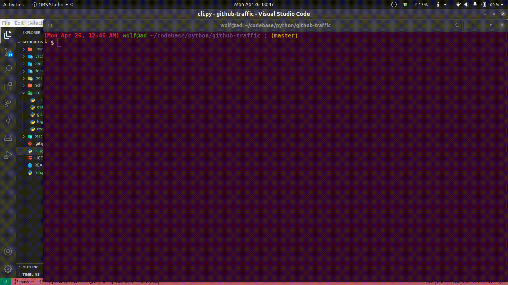
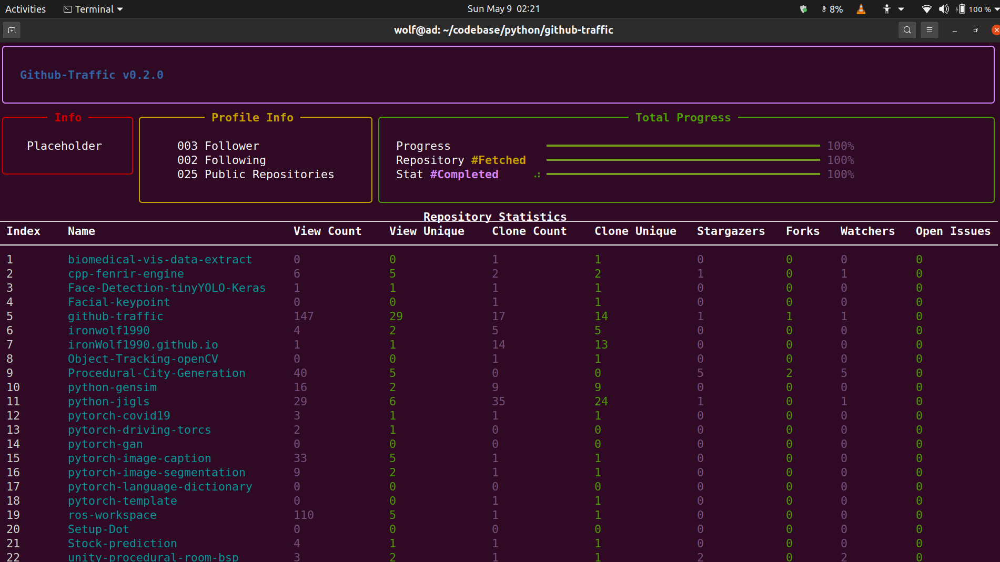

GITHUB-TRAFFIC
==============
## Description

A simple python program that fetches users repository traffic and insight

<!-- 

    

 -->

    

### Usage

**`python3 cli.py --config=config/demo.conf`**

## Table of Content

- [Dependencies](#dependencies)

* [Personal Token](#personaltoken)

### Dependencies

- [Rich](https://pypi.org/project/rich/)

### Personal Token

You will need to generate a [Personal Access Token](https://docs.github.com/en/github/authenticating-to-github/creating-a-personal-access-token) and paste it in a *.conf* file as shown [`here`](config/demo.conf). Make sure token has **`repo`** scope

---

# Changelog

<!-- ## Version: 0.2.0 - 2021-04-27

### Added

- Userinfo

### Changed

- console output -->

## Version: 0.1 - 2021-04-26

### Fixed

- Rich console formatting
